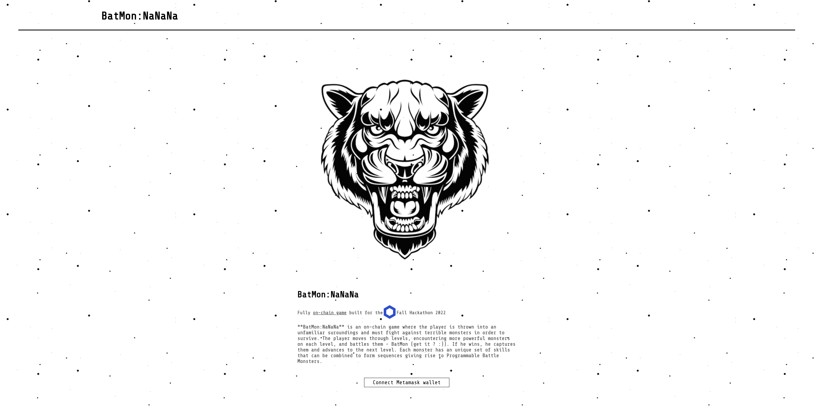

# BatMon:NaNaNa

This repo represents my submission for the Chainlink's 2022 Fall hackathon

**Applicable tracks** :

-   Chainlink's NFT & Gaming track (uses Chainlink's VRFv2 to determine the outcome of the match)
-   Polygon's track (contracts deployed on Mumbai testnet)

## Overview

The **BatMon:NaNaNa** game asks the question of what kind of game can be built purely on-chain.

The goal of the game is to capture all of the monsters inside it. It is organized in levels, with each level containing a new monster. The player must conquer the monster on the current level in order to advance to the next one.

Each monster has a unique set of skills which can be used to form sequences - giving rise to programmable Battle Monsters - BatMon. The player programs their own monster using these sequences and unleashes them.

### How it works

#### Core mechanics

-   At the start of the game, player registers which triggers a minting of an NFT (`ProgressNFT`)
-   That NFT is used to keep track of its owners progress in the game
    -   **most successful players can choose to sell this NFT** which creates a Play-To-Earn (P2E) mechanism
-   At the start of the game, player can use 2 monsters
-   Game is divided into levels - each level has an new unique monster associated with it
-   Before the start of a level, player chooses their monster and programs it (will be discussed later)
-   To move to the next level player needs to defeat the monster on the current level and capture it
-   **Captured monsters can be used on the upcoming levels**

#### Programming monsters

-   Each monster has skills that can be used in battle
-   Player can program 3 sequence from the available skills for the choosen monster
-   Each sequence has the same probability to be used and executed
-   After the current sequence has ended, new one is randomly chosen (**done on-chain**)

#### Battle logic

-   Battle is divided into moves
-   Only one monster attacks per move (determined randomly)
-   The effects of an active skill of the monster that atacks are applied to the oposing monster
-   Battle is finished if the health of any monster goes to 0, or if the maximum amount of moves (50) has been reached (winner determined by the monsters' health relation)

## Relevant links

[DevPost Link](https://devpost.com/software/batmon-nanana)

[BatMon contract](https://mumbai.polygonscan.com/address/0x71060AfF9d562474915b099df231f1864D73c71E#code) deployed on Polygon Mumbai

[ProgressNFT contract](https://mumbai.polygonscan.com/address/0x2A933824EfE133d5689E225b58A2598e1ab6829f#code) deployed on Polygon Mumbai

### DEMO

## Testing instructions

Repo containts two sub-directories:

-   `./back` - Hardhat project (for contract development/deployment)
-   `./front` - React projet (frontend)

For both sub-directories:

-   `cd <subdir> && npm i` - installs the dependencies

For contract compilation / development

-   `cd back`
-   `npx hardhat compile / run scripts/deploy.js ...`

For starting the frontend:

-   `cd front && npm start`
